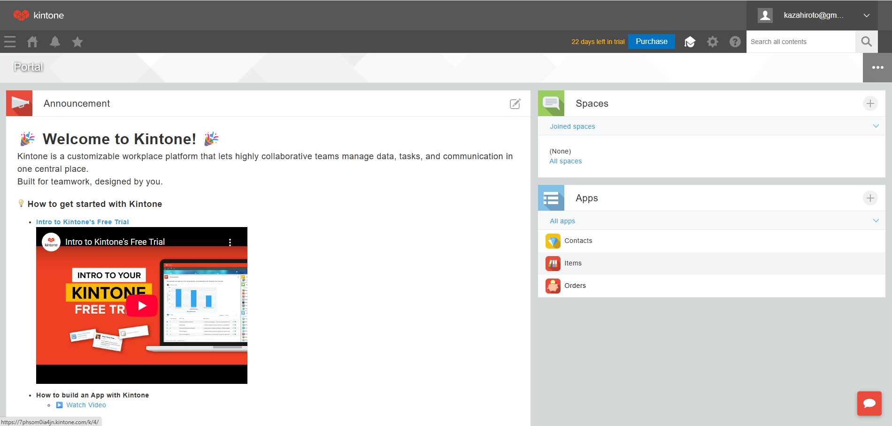
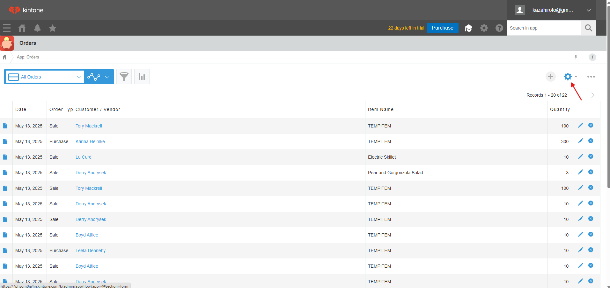
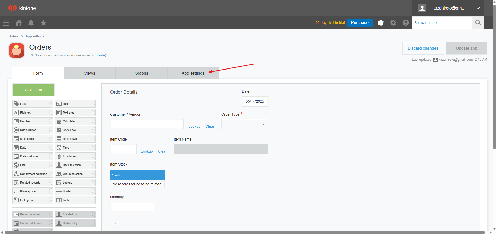
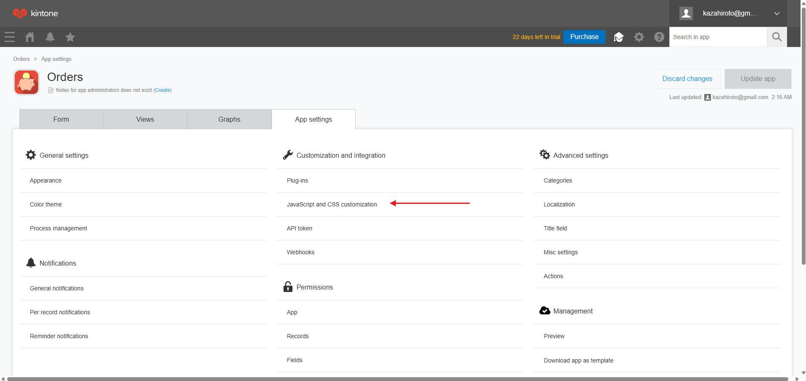
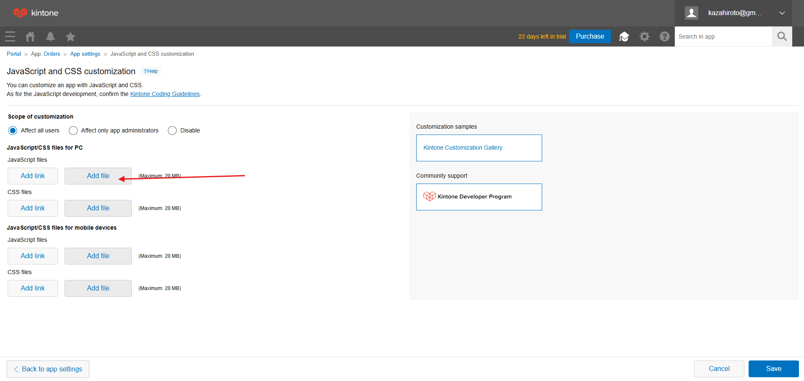
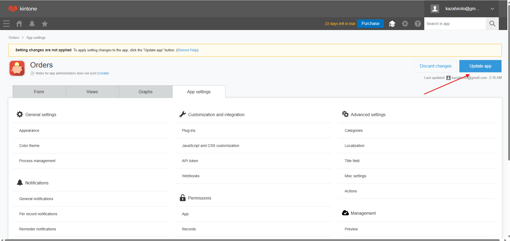

# Installation Guide for Order Management Automation

## Prerequisites
1. You must have a Kintone account with administrator privileges
2. Items app must be already set up with:
   - Item Code (Text field)
   - Stock (Number field)
3. Order app must be already created

## Installation Steps

### Add the Automation Script
1. Go to your Order app
   

2. Click the gear icon ⚙️ → **App Settings**
   
   

3. Go to **JavaScript and CSS Customization**
   

4. Click **Upload New File** button
   

5. Select the `automation.js` file you downloaded
   

6. Click **Save** and then **Update App**
   
